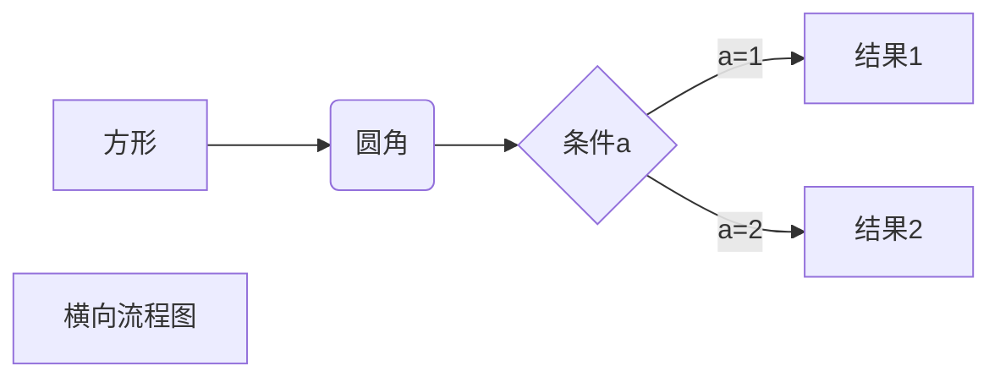

---
nav:
  title: Components
  path: /components
---

## Menu

Demo:

```tsx
import React from 'react';
import { Menu } from '@tms/trialos-public-component';

export default () => {
  return (
    <Menu>
      <Menu.Item>00000</Menu.Item>
      <Menu.Item>99999</Menu.Item>
      <Menu.SubMenu title={'我是subMenu'}>
        <Menu.Item> submenu1</Menu.Item>
        <Menu.Item> submenu2</Menu.Item>
        <Menu.Item> submenu3</Menu.Item>
      </Menu.SubMenu>
      <Menu.Item>888</Menu.Item>
    </Menu>
  );
};
```

| 表头   | 表头   |
| ------ | ------ |
| 单元格 | 单元格 |
| 单元格 | 单元格 |

```javascript
$(document).ready(function() {
  alert('RUNOOB');
});
```

使用 <kbd>Ctrl</kbd>+<kbd>Alt</kbd>+<kbd>Del</kbd> 重启电脑

这个链接用 1 作为网址变量 [Google][1]
这个链接用 runoob 作为网址变量 [Runoob][runoob]
然后在文档的结尾为变量赋值（网址）

[1]: http://www.google.com/
[runoob]: http://www.runoob.com/



- 第一项
- 第二项
- 第三项

# 一级标题

## 二级标题

### 三级标题

#### 四级标题

##### 五级标题

###### 六级标题

More skills for writing demo: https://d.umijs.org/guide/demo-principle
